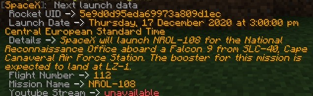
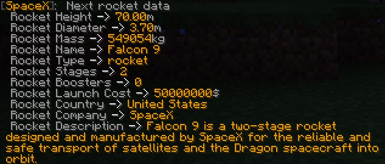

## SpacexAnnouncer

[](https://github.com/TheViperShow/SpacexAnnouncer/issues) [](https://github.com/TheViperShow/SpacexAnnouncer/network) [](https://github.com/TheViperShow/SpacexAnnouncer/stargazers) [](https://github.com/TheViperShow/SpacexAnnouncer)  
<br>
Get information about next launches and Space-X rockets!
<h5> Features </h5>

This plugin brings several commands that will make you able to interact and communicate with SpaceX API!
This plugin currently required Java 11 and onwards to work properly. This plugin will however work on any Bukkit-based
platform, such as Spigot, Paper, Tuinity, etc...
<h5> Data Caching </h5>

This plugin uses an efficient data caching system. This allows your system\server to save bandwidth and greatly improve
response time for commands. The caching system stores data for the last 60 seconds, making commands faster and avoiding
excessive HTTP requests. This value will be increased in the future and will probably even set to be configurable.
<h5> Commands </h5>

```/space-x next launch```
<br/>
<strong> Required Permission </strong>: spacex.next
<br/>
<strong> Description </strong>: This command is used to obtain basic information about the next launch that is going to
be performed by Space-X. This command fetches the latest api (v4)
and the player that executed this command will receive basic formatted information via chat. This command also supports
console executors.
<br/>

<br/><br/>
```/space-x next rocket```
<br/>
<strong> Required Permission </strong>: spacex.next
<br/>
<strong> Description </strong>: This command is used to obtain basic information about the rocket that is going to be
used in the next Space-X mission. This command first fetches the latest api (v4)
,it obtains the rocket UID from the launch next launch request, and then it sends another request to get the rocket with
that specific UID. The player that executed this command will receive basic formatted information via chat. This command
also supports console executors.
<br/>

<br/>
<h3> Licensing <h3/>
This project currently is under the GNU AFFERO GENERAL PUBLIC LICENSE Version 3.
<br/>
A copy of it has been provided inside this repository.
